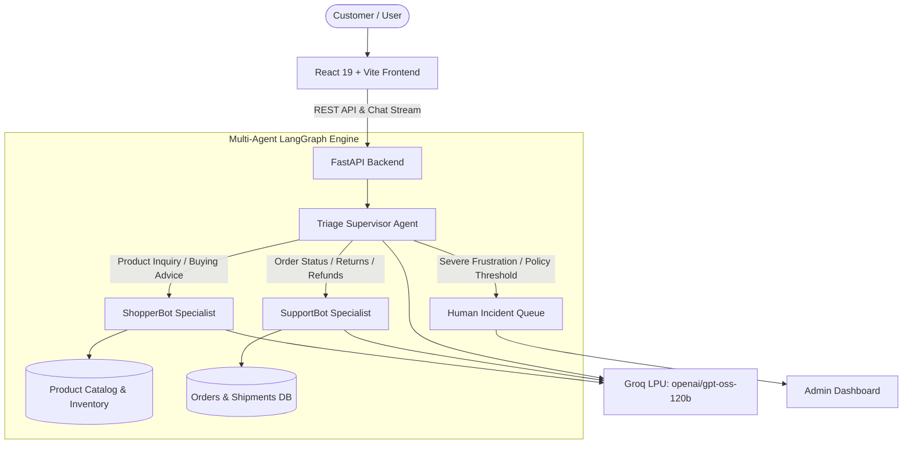

# ElectroVerse - Autonomous Multi-Agent E-Commerce & Customer Support Platform

[](https://www.python.org/)
[](https://fastapi.tiangolo.com/)
[](https://react.dev/)
[](https://vitejs.dev/)
[-f55036.svg)](https://groq.com/)
[](LICENSE)

ElectroVerse is an intelligent, full-stack e-commerce platform powered by an autonomous multi-agent AI system. It orchestrates high-speed LLM reasoning via Groq LPUs to deliver real-time product discovery, visual order tracking, automated customer support, and human-in-the-loop escalation.

---

## Key Features

- **Autonomous Multi-Agent Architecture**:
  - **Triage Supervisor (`TriageBot`)**: Deterministically routes customer inquiries to specialized agents or escalates to human agents based on intent, sentiment, and safety guardrails.
  - **Product Discovery Agent (`ShopperBot`)**: Context-aware product specialist that searches specifications, compares features, verifies live inventory, and provides budget-tailored recommendations.
  - **Support Specialist (`SupportBot`)**: Manages order tracking, return requests, replacements, cancellations, and refunds strictly adhering to business guardrails (30-day return policy, auto-refund thresholds).
  - **Human-in-the-Loop Admin Escalation**: Live incident queue where support agents can review flagged conversations, inspect LLM reasoning, and resolve customer issues.

- **Verified Electronics Storefront**:
  - Curated catalog of 50+ pure electronic devices across Laptops, Smartphones, Tablets, Headphones/Headsets, Cameras, and Essential Accessories.
  - Category filters, real-time search, stock status badges, and detailed hardware specifications.

- **Myntra/Meesho-Style Order Tracking**:
  - Visual 4-stage tracking stepper (**Order Placed** -> **Shipped** -> **In Transit** -> **Delivered**).
  - Dedicated per-item "Chat Support" button that pre-loads order context directly into the AI agent.

- **Full-Page Shopping Bag & Checkout**:
  - Interactive cart management with quantity adjustments, real-time subtotal/tax calculations, and 1-click order placement.

- **Customer & Admin Authentication**:
  - Equal-spaced tabbed authentication (Customer Login / Customer Sign Up).
  - Session-based persistence backed by SQLite.

---

## Multi-Agent Architecture



---

## Tech Stack

### Backend
- **Framework**: FastAPI (Python 3.10+)
- **Server**: Uvicorn
- **AI / LLM**: Groq SDK (`openai/gpt-oss-120b` text model, vision models)
- **Agent Orchestration**: LangGraph / LangChain Core
- **Database**: SQLite3 (with automated schema migration and product seeding)
- **Configuration**: Pydantic, Python-Dotenv

### Frontend
- **Framework**: React 19
- **Bundler & Tooling**: Vite 8, Oxlint
- **Icons**: Lucide React
- **Design System**: Vanilla CSS with custom dark mode, glassmorphism, responsive grid layouts

---

## Project Structure

```text
ElectroVerse-Customer-Support/
├── backend/
│   ├── agents/
│   │   ├── shopper.py         # Product discovery & catalog recommendation agent
│   │   ├── support.py         # Order tracking, refund & policy enforcement agent
│   │   └── triage.py          # Supervisor agent for intent classification & routing
│   ├── config.py              # LLM models, guardrails & temperature configuration
│   ├── database.py            # SQLite schema initialization & seeding
│   ├── ecommerce.db           # SQLite database
│   ├── llm_client.py          # Groq API client with error handling & retries
│   ├── main.py                # FastAPI endpoints for auth, products, orders & chat
│   ├── products_data.py       # Verified catalog of electronic items
│   ├── requirements.txt       # Python dependencies
│   └── text_cleaner.py        # Markdown formatting and normalization utilities
├── frontend/
│   ├── src/
│   │   ├── App.jsx            # Main storefront, cart, order tracking & chat UI
│   │   ├── index.css          # Design system, stepper animations, and themes
│   │   └── main.jsx           # React DOM root entry
│   ├── index.html             # HTML entry point with ElectroVerse branding
│   ├── package.json           # Frontend dependencies and scripts
│   └── vite.config.js         # Vite configuration
├── .env                       # Environment configuration (API keys)
├── .gitignore                 # Git ignore rules
└── README.md                  # Project documentation
```

---

## Getting Started

### Prerequisites
- **Python**: 3.10 or higher
- **Node.js**: 18.x or higher
- **Groq API Key**: Obtain a free API key from [Groq Console](https://console.groq.com)

---

### Step 1: Clone the Repository

```bash
git clone https://github.com/Kaviyasree27/ElectroVerse-Customer-Supoport.git
cd ElectroVerse-Customer-Supoport
```

---

### Step 2: Configure Environment Variables

Create a `.env` file in the root directory:

```env
GROQ_API_KEY=your_groq_api_key_here
GROQ_TEXT_MODEL=openai/gpt-oss-120b
GROQ_VISION_MODEL=openai/gpt-oss-20b
```

---

### Step 3: Run the Backend (FastAPI)

1. Open a terminal in the project root:
   ```bash
   # (Optional) Create and activate virtual environment
   python -m venv venv
   .\venv\Scripts\activate   # On Windows
   # source venv/bin/activate # On macOS/Linux

   # Install dependencies
   pip install -r backend/requirements.txt
   ```

2. Start the FastAPI server:
   ```bash
   python -m uvicorn backend.main:app --host 127.0.0.1 --port 8000 --reload
   ```

The backend API will be available at `http://127.0.0.1:8000`.  
Swagger documentation is available at `http://127.0.0.1:8000/docs`.

---

### Step 4: Run the Frontend (React + Vite)

1. Open a second terminal window and navigate to `frontend`:
   ```bash
   cd frontend
   npm install
   ```

2. Start the development server:
   ```bash
   npm run dev
   ```

The frontend will run at `http://127.0.0.1:5173`.

---

## Usage Guide

1. **Browse Products**: Explore laptops, phones, headphones, cameras, and accessories with live search and price filters.
2. **Shop & Order**: Add items to your shopping cart and place orders.
3. **Track Shipments**: Open the **My Orders** tab to view your 4-stage visual progress stepper.
4. **Chat with ShopBot**:
   - Ask for recommendations (e.g., *"Find me a gaming laptop with RTX 4060 under 1 Lakh"*).
   - Click **Chat Support** on any order card to get instant status or initiate returns/refunds.
5. **Admin Operations**: View the incident queue for escalated support requests and audit system-wide orders.

---

## Agent Guardrails & Policies

- **30-Day Return Cutoff**: Returns are strictly evaluated against the 30-day delivery threshold.
- **Auto-Refund Safeguard**: Refunds under $50 / ₹4,000 can be processed autonomously; larger amounts are escalated to human staff.
- **Deterministic Triage**: Temperature 0.0 prevents hallucinations during intent classification and safety checks.

---
Login Page:


ShopperBot:


SupportBot:


TriageBot:


## License

This project is licensed under the MIT License.
